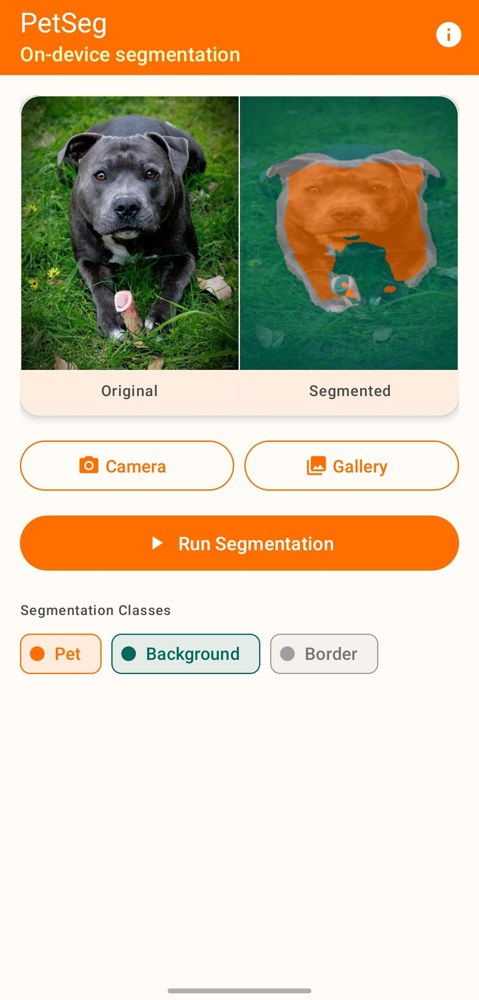
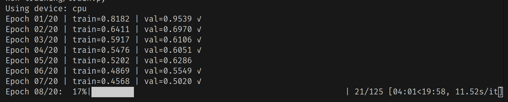
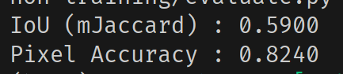
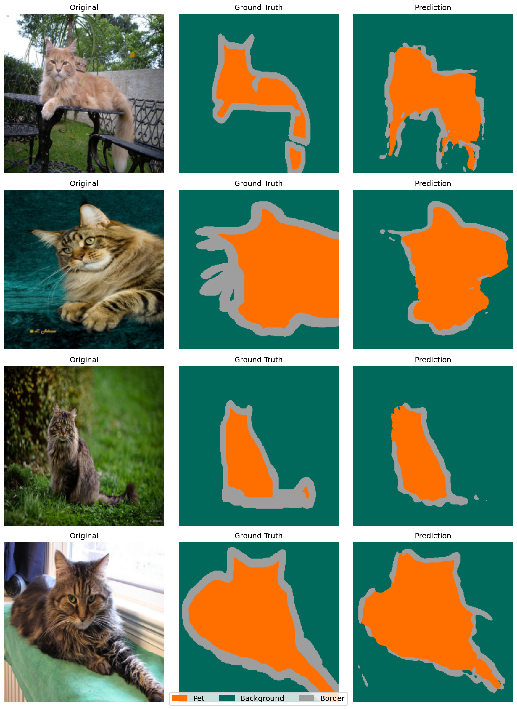

# Pet Segmentation Mobile

Pipeline completo de segmentação semântica de animais domésticos: treinamento de UNet em PyTorch → exportação para TFLite → inferência on-device em Android.

> **Dataset:** [Oxford-IIIT Pet](https://www.robots.ox.ac.uk/~vgg/data/pets/) — baixado automaticamente pelo script de treino.

---

## Demonstração

<p align="center">
  
</p>

O app captura uma foto pela câmera ou galeria e exibe o overlay colorido de segmentação com três classes: **Pet**, **Background** e **Border**.

---

## Pipeline

```
train.py ──► best.pth
export.py ──► model.tflite
build.sh ──► android/app/src/main/assets/model.tflite
gradlew ──► app-debug.apk
```

### Classes de segmentação

| Classe | Cor | Descrição |
|--------|-----|-----------|
| Pet | Laranja | Corpo do animal |
| Background | Verde-escuro | Fundo da imagem |
| Border | Cinza | Contorno/borda do animal |

---

## Pré-requisitos

### 1. Miniconda

```bash
wget https://repo.anaconda.com/miniconda/Miniconda3-latest-Linux-x86_64.sh
bash Miniconda3-latest-Linux-x86_64.sh
# Reiniciar o terminal após instalar
```

### 2. Java 17

```bash
sudo apt install openjdk-17-jdk
```

> **Atenção:** Java 21 é incompatível com Gradle 8.x. Use Java 17.

### 3. Android SDK

**Opção A — Android Studio (recomendado):**
Baixar em [developer.android.com/studio](https://developer.android.com/studio). SDK instalado automaticamente.

**Opção B — Command Line Tools:**
```bash
# Baixar em https://developer.android.com/studio#command-tools
mkdir -p ~/Android/Sdk/cmdline-tools/latest
unzip commandlinetools-linux-*.zip -d ~/Android/Sdk/cmdline-tools/latest

export ANDROID_HOME=~/Android/Sdk
export PATH=$PATH:$ANDROID_HOME/cmdline-tools/latest/bin

sdkmanager "platform-tools" "platforms;android-34" "build-tools;34.0.0"
echo "sdk.dir=$HOME/Android/Sdk" > android/local.properties
```

### 4. ADB

Incluído no Android SDK (`platform-tools`). Alternativa:
```bash
sudo apt install adb
```

### Opcional — GPU CUDA 11.8

Acelera o treinamento. Sem GPU, treino roda na CPU (mais lento).

---

## Uso Rápido

```bash
# Pipeline completo: treino → export → APK
./build.sh

# Reusar best.pth existente (pular treino)
./build.sh --skip-train

# Só build Android (requer model.tflite gerado)
./build.sh --android-only
```

O script cria o ambiente conda `deepl` e instala todas as dependências automaticamente.

---

## Pipeline Detalhado

### Fase 1 — Treinamento

```bash
conda activate deepl
cd training
python train.py
```

20 épocas com Adam (lr=1e-3) e CrossEntropyLoss. O símbolo `√` indica novo melhor val loss e atualização do `best.pth`.

<p align="center">
  
</p>

---

### Fase 2 — Avaliação e Visualização

```bash
python evaluate.py   # IoU e pixel accuracy no conjunto val
python visualize.py  # gera results.png com 4 amostras
```

**Métricas no conjunto de validação (200 imagens):**

<p align="center">
  
</p>

| Métrica | Valor |
|---------|-------|
| mIoU (mJaccard) | 0.59 |
| Pixel Accuracy | 0.82 |

**Comparação visual — Original · Ground Truth · Predição:**

<p align="center">
  
</p>

---

### Fase 3 — Exportação

```bash
python export.py
# PyTorch (.pth) → ONNX (opset 12) → TF SavedModel → TFLite FP32
# Saída: model.tflite
```

### Fase 4 — Build Android

```bash
cd android
./gradlew assembleDebug
adb install -r app/build/outputs/apk/debug/app-debug.apk
```

---

## Arquitetura do Modelo

UNet com encoder-decoder de 5 níveis e skip connections.

| Componente | Detalhe |
|------------|---------|
| Entrada (TFLite) | `[1, 256, 256, 3]` FP32 NHWC, normalização ImageNet |
| Encoder | 64 → 128 → 256 → 512 → 1024 canais, max-pooling |
| Decoder | Upsampling bilinear + concatenação via skip connections |
| Saída | `[1, 256, 256, 3]` logits (3 classes) |
| Otimizador | Adam, lr=1e-3 |
| Loss | CrossEntropyLoss |

---

## App Android

Kotlin + TensorFlow Lite 2.14. Dois componentes principais:

| Classe | Responsabilidade |
|--------|-----------------|
| `MainActivity.kt` | Input câmera/galeria, botões, exibe painel duplo |
| `Segmentor.kt` | Carrega `model.tflite`, preprocess → inferência → argmax → overlay |

```
MainActivity ──► Segmentor
     │                │
  UI + input    preprocess → infer → argmax → color overlay
```

---

## Estrutura do Projeto

```
pet_segmentation_mobile/
├── build.sh                  # Orquestração end-to-end
├── imgs/                     # Screenshots e capturas do pipeline
├── training/
│   ├── model.py              # Arquitetura UNet
│   ├── dataset.py            # Loader Oxford-IIIT Pet
│   ├── train.py              # Loop de treinamento
│   ├── evaluate.py           # Métricas (IoU, pixel accuracy)
│   ├── visualize.py          # Plot de amostras
│   ├── export.py             # Conversão PyTorch → TFLite
│   ├── requirements.txt      # Dependências Python
│   └── best.pth              # Checkpoint (gerado pelo treino)
└── android/
    └── app/src/main/
        ├── java/com/petseg/mobile/
        │   ├── MainActivity.kt
        │   └── Segmentor.kt
        └── assets/
            └── model.tflite  # Copiado pelo build.sh
```
